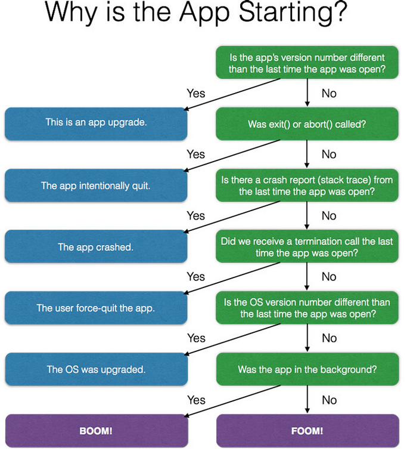
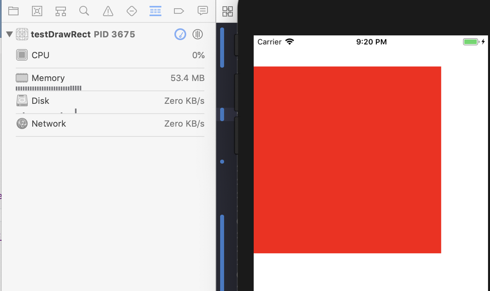
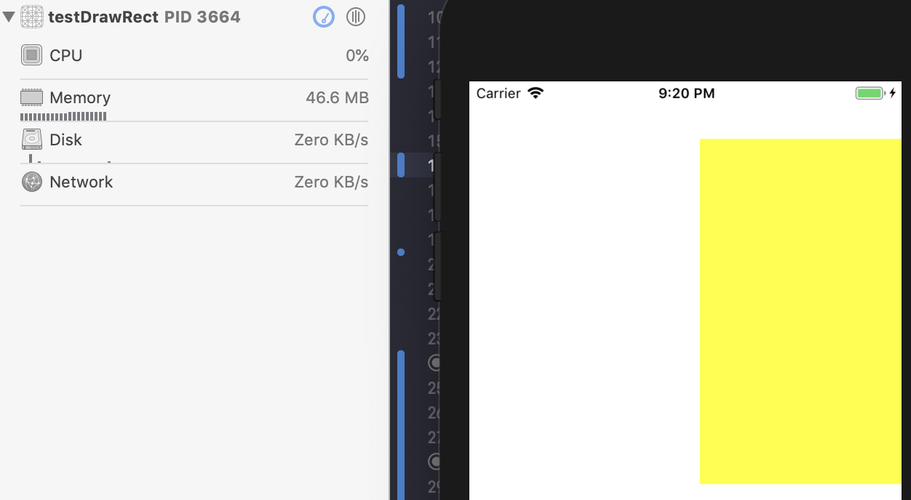

# iOS内存监测原理
<br>

介绍：手Y从7.11版本开始引入了线上内存监测功能，目的在于降低手Y内存占用，降低OOM出现的频率，本文主要是简单的介绍下OOM的上报、内存监测原理、内存优化分析等操作。  

<br>

### 一、OOM的上报  

OOM分为FOOM和BOOM：    

###### 1. FOOM(Foreground Out Of Memory)：是指App在前台因为消耗内存过多而引起的崩溃，展示形式与crash类似，但是crash系统并不能补抓这类崩溃。（实测，在iPhone7的手Y中内存消耗到700M左右会产生FOOM）。

###### 2. BOOM(Background Out Of Memory)：是指iOS系统消耗过多内存，需要杀掉挂在后台的App来释放所占用的内存，这个时候，同一优先级进程下，会优先kill掉占用内存多的App。  

<br>

系统kill进程的过程：

系统内部有一个进程优先级队列，当内存紧张时，优先级低的进程先被干掉，只有当foreground前面优先级的进程全被kill掉后，这时内存依然紧张，才会kill foreground进程。当触发OOM时，系统会先按照进程的优先级去kill优先级低的进程，当处于同一优先级时，会先kill掉占用内存大的进程，每kill掉一个进程就会重新检测下可用内存是否足够，不够会继续kill进程。如果把所有后台进程都kill了，可用内存还是不够，那么就会kill掉当前的foreground进程。  

Facebook在15年就提出了FOOM监测办法，链接：[FaceBook FOOM](https://code.fb.com/ios/reducing-fooms-in-the-facebook-ios-app/)

大致监测原理：  

OOM与Crash表现一致，虽然无法被Crash系统捕获，但总的来说App是被kill了，也就是完全退出了。基于此，实时记录上一次退出的原因到沙盒，然后就可以将问题转化为导致这一次App重启是什么？

 App再次被打开的原因（上一次使用中直接退出），facebook给出的有下面原因：

> 1.   app在使用中直接更新
> 2.   收到exit、abort信号，直接终止
> 3.   收到crash导致的退出
> 4.   用户强制退出App
> 5.   系统升级，iPhone重启
> 6.   FOOM和BOOM

如图：



在上述基础上再次细分：

> 1. 第一次下载App后第一次打开
> 2. 排除Debug状态的信息收集，避免误判
> 3. 分FOOM和BOOM两种状态进行信息收集，FOOM是必须要进行处理降低的，BOOM需要检查代码中可以优化的地方从而降低内存

具体代码可以看手Y的YYOutOfMemoryStatistics类。

对应的github上的一个OOM上报代码：[MemoryNoodler](https://github.com/jflinter/JRFMemoryNoodler)   	

Github上的OOM是会有比较多的误报，也没有继续进行细分，是需要继续优化的。

根据统计数据，手Y中的OOM基本是BOOM。

<br>

### 二、内存监测原理

###### 1. 利用fishhook可以hook掉非系统库里面的C\C++分配内存等函数的调用，在此过程中统一收集内存分配信息、堆栈信息（malloc\calloc\realloc\valloc\block_copy\free等）。这个想法可行，但它只能hook非系统的C\C++内存分配函数，OC的alloc方法分配内存只能是再次hook alloc方法来重新收集相关的信息。

```objc
static bool isPaused = false;
static void* (*orig_malloc)(size_t);
static void* (*orig_calloc)(size_t, size_t);
static void* (*orig_realloc)(void *, size_t);
static void* (*orig_valloc)(size_t);
static void* (*orig_block_copy)(const void *aBlock);

void recordMallocStack(vm_address_t address,uint32_t size,string name,size_t stack_num_to_skip) {
}


void removeMallocStack(vm_address_t address) {
    
    
}

void *new_malloc(size_t size)
{
    void *ptr = orig_malloc(size);
    if(!isPaused){
        recordMallocStack((vm_address_t)ptr, (uint32_t)size,"malloc",2);
    }
    return ptr;
}

void *new_calloc(size_t n,size_t size)
{
    void *ptr = orig_calloc(n,size);
    if(!isPaused){
        recordMallocStack((vm_address_t)ptr, (uint32_t)(n*size),"calloc",2);
    }

    return ptr;
}

void *new_realloc(void *old_ptr, size_t size)
{
    void *ptr = orig_realloc(old_ptr, size);
    if(!isPaused){
        if (old_ptr) {
            removeMallocStack((vm_address_t)old_ptr);
        }
        recordMallocStack((vm_address_t)ptr, (uint32_t)(size),"realloc",2);
    }
    
    return ptr;
}

void *new_valloc(size_t size)
{
    void *ptr = orig_valloc(size);
    if(!isPaused){
        recordMallocStack((vm_address_t)ptr, (uint32_t)size,"valloc",2);
    }

    return ptr;
}

void *new_block_copy(const void *aBlock){
    void *block = orig_block_copy(aBlock);
    if(!isPaused) {
        recordMallocStack((vm_address_t)block, 0,"__NSMallocBlock__",2);
    }

    return block;
}


void beSureAllRebindingFuncBeenCalled()
{
    //Note: https://github.com/facebook/fishhook/issues/43
    //      The issue still open. Keep watching.
    void *info = malloc(1024);
    info = realloc(info, 100 * 1024);
    free(info);
    
    info = calloc(10, 1024);
    free(info);
    
    info = valloc(1024);
    free(info);
    
    dispatch_block_t temp = Block_copy(^{});
    Block_release(temp);
}

void hookMalloc()
{
    if(!isPaused) {
        beSureAllRebindingFuncBeenCalled();
        
        orig_malloc = malloc;
        orig_calloc = calloc;
        orig_valloc = valloc;
        orig_realloc = realloc;
        orig_block_copy = _Block_copy;
        
        rebind_symbols((struct rebinding[5]){
            {"realloc",(void*)new_realloc,(void**)&orig_realloc},
            {"malloc", (void*)new_malloc, (void **)&orig_malloc},
            {"valloc",(void*)new_valloc,(void**)&orig_valloc},
            {"calloc",(void*)new_calloc,(void**)&orig_calloc},
            {"_Block_copy",(void*)new_block_copy,(void**)&orig_block_copy}}, 5);
    }

}
```

fishhook的github地址：[fishhook](https://github.com/facebook/fishhook)

例如说，只是针对大内存模块的信息记录，可以在recordMallocStack方法里面判断size的大小来达到目的。但是需要注意这个时候不能直接recordMallocStack方法如下记录堆栈信息：

```objc
void* callstack[35];
int frames = backtrace(callstack, 35);
char **strs = backtrace_symbols(callstack, frames);
```

因为backtrace_symbols在翻译callstack的时候会调用C\C++的malloc\realloc内存分配方法，陷入死循环。

这里可以衍生出一个能检测线上内存泄漏且不影响业务和用户体验的方案：[线上监测内存泄漏](http://www.cocoachina.com/ios/20180605/23658.html)

<br>

###### 2. 通过设置libmalloc中的malloc_logger和__syscall_logger函数指针，从而达到在我们开发所写的代码层面捕获malloc/free/realloc/vm_allocate/vm_deallocate等所有的内存分配/释放函数的信息，这也是内存调试工具malloc stack的实现原理。有了这些信息，我们是可以轻易的记录内存的分配大小、分配堆栈，分配堆栈可以用backtrace函数捕获，但捕获到的地址是虚拟内存地址，不能从符号表dsym解析符号。所以还要记录每个image加载时的偏移slide，这样符号表地址=堆栈地址-slide。

libmalloc源码：[libmalloc](./libmalloc-53.1.1.tar.gz)

在src目录下stack_logging_disk.c文件中：


（这里主要介绍下malloc_logger函数指针，__syscall_logger与之类似）。

在代码中只需要设置下指针即可捕获内存分配信息：

```objc
#import <Foundation/Foundation.h>
#import <malloc/malloc.h>

#ifdef __cplusplus   //如果是C++环境，这个宏存在
extern "C" {        //声明这是C语言
#endif
    
    typedef void (malloc_logger_t)(uint32_t type, uintptr_t arg1, uintptr_t arg2, uintptr_t arg3, uintptr_t result, uint32_t num_hot_frames_to_skip);
    
    void my_stack_logger(uint32_t type, uintptr_t arg1, uintptr_t arg2, uintptr_t arg3, uintptr_t result, uint32_t backtrace_to_skip);
    
    extern malloc_logger_t *malloc_logger;
    
#ifdef __cplusplus
    }
#endif


#import "CommonMallocLogger.h"

#if __has_feature(objc_arc)
#error This file must be compiled without ARC. Use -fno-objc-arc flag.
#endif

malloc_zone_t *global_memory_zone;

void my_stack_logger(uint32_t type, uintptr_t arg1, uintptr_t arg2, uintptr_t arg3, uintptr_t result, uint32_t backtrace_to_skip)
{
    /*
    type : 这次捕获到的内存信息类型 32位的二进制： ... 0000 0000 0000 0000
    		1<< 1 ,  malloc, realloc, etc...
    		1<< 2 ,  free, realloc, etc...
    		1<< 3 ,  NSZoneMalloc, etc... 
    		1<< 4 ,  vm_allocate or mmap
    		1<< 5 ,  vm_deallocate or munmap
    首先需要先对type进行处理，让type的二进制中的第四位置为0
    因为一旦第四位为1，第二位或第三位必定为1，依然可以进入分配内存还是销毁内存的判断
    
    处理完后：
    当type == ((1<< 1) & (1<< 2)) 为YES :   (例如是realloc)
    		result为新分配内存的虚拟内存地址
    		arg3为分配内存size
    		arg2为old的内存虚拟地址，可能与result相同
    				
    
    当type & (1<< 1) 为 YES :
    		arg2 为分配内存size
    		result为虚拟内存地址
    		
    当type == (1<< 2) 为YES :
    		arg2 为虚拟内存地址
    */
    NSLog(@"------------------%s", __func__);
}


- (BOOL)application:(UIApplication *)application didFinishLaunchingWithOptions:(NSDictionary *)launchOptions {
    // Override point for customization after application launch.
    
    malloc_logger = (malloc_logger_t *)my_stack_logger;
    return YES;
}
```

在my_stack_logger函数里面即可处理捕获到的信息。

腾讯的OOMDetector库的监测内存泄漏和大内存分配原理就是1、2了。

<br>

### 三、内存优化分析

###### 1. 谨慎重写UIView的drawRect方法

如下两个一样大小、不同颜色的View，一个重写drawRect方法，一个不重写，分别创建五个的内存变化：

```objc
@implementation ZYRedView

- (instancetype)initWithFrame:(CGRect)frame {
    if (self = [super initWithFrame:frame]) {
        self.backgroundColor = [UIColor redColor];
    }
    return self;
}

- (void)drawRect:(CGRect)rect {
    
}
@end
```

```objc
@implementation ZYYellowView
- (instancetype)initWithFrame:(CGRect)frame {
    if (self = [super initWithFrame:frame]) {
        self.backgroundColor = [UIColor yellowColor];
    }
    return self;
}
@end
```





红色的view重写了drawRect方法，每创建一个大约是占1.4M内存。黄色的view创建起来内存基本无变化。

重写drawRect后所占内存与所创建的view的大小和屏幕分辨率有关，大致可以这么计算：

view.width * view.height * 3 * 4 字节

<br>

重写drawRect会内存暴涨的原因：

每一个UIView都有一个CALayer，实际来说CALayer才是用来真正显示在屏幕上的，UIView只是对CALayer的一个封装，提供了事件交互等功能。而CALayer也并不能直接渲染到屏幕行，之所以能真正显示在屏幕上是因为有contents属性，contents属性是id类型，但是只有传入CGImage的时候，它才能正常显示在屏幕上，换句话说，iOS中实际在屏幕上看到的东西都是一张张图片。最终的图形渲染落在contents上。

当重写drawRect方法时，实际也就是在contents上进行绘制，drawRect 方法没有默认的实现，因为对UIView来说，寄宿图并不是必须的，UIView不关心绘制的内容。如果UIView检测到drawRect方法被调用了，它就会为视图分配一个寄宿图，这个寄宿图的像素尺寸等于视图大小乘以contentsScale 的值。

手Y中的将圆形头像显示AvatarControl的drawRect改成了CAShapeLayer显示：

```objc
//原代码
- (void)drawRect:(CGRect)rect
{
    if(self.borderWidth > 0)  //当设置边框时采用绘制，否则直接采用图片显示（由于图片没有边框）
    {
        CGContextRef context = UIGraphicsGetCurrentContext();
        CGContextSaveGState(context);

        CGFloat widthHeight = MIN(self.frame.size.width - self.borderWidth, self.frame.size.height - self.borderWidth);
        CGFloat x = (self.frame.size.width - widthHeight) / 2;
        CGFloat y = (self.frame.size.height - widthHeight) / 2;
        CGRect rectToRenderBorder = CGRectMake(x, y, widthHeight, widthHeight);

        CGContextAddEllipseInRect(context, rectToRenderBorder);

        CGContextSetStrokeColorWithColor(context, UIColor.whiteColor.CGColor);
        CGContextSetLineWidth(context, self.borderWidth);
        CGContextDrawPath(context, kCGPathStroke);

        CGContextRestoreGState(context);
    }
}
```

```objc
//现代码
- (void)configShapeLayer {
    
    if(self.borderWidth > 0)  //当设置边框时采用绘制，否则直接采用图片显示（由于图片没有边框）
    {
       
        self.shapeLayer.frame = self.bounds;
        CGFloat widthHeight = MIN(self.frame.size.width - self.borderWidth, self.frame.size.height - self.borderWidth);
        CGFloat x = (self.frame.size.width - widthHeight) / 2;
        CGFloat y = (self.frame.size.height - widthHeight) / 2;
        CGRect rectToRenderBorder = CGRectMake(x, y, widthHeight, widthHeight);
        
        [self.shapeLayer setFillColor:[UIColor clearColor].CGColor];
        [self.shapeLayer setStrokeColor:UIColor.whiteColor.CGColor];
        [self.shapeLayer setLineWidth:self.borderWidth];

        CGMutablePathRef pathRef = CGPathCreateMutable();
        CGPathAddEllipseInRect(pathRef, NULL, rectToRenderBorder);
        self.shapeLayer.path = pathRef;
        CGPathRelease(pathRef);
    }
}
```

因为头像改完影响的范围比较广，都需要进行测试，现在暂时只修改了这个drawRect，后续会将不必要的重写drawRect代码使用专有图层替代。

<br>

###### 2.优化内存的若干分享

A. 比较常见的在循环里面创建多个对象、size比较大的NSData、UIImage等时，使用@autoreleasepool：

```objc
for (int i = 0; i < 1000; i++) {
        @autoreleasepool {
            NSString *str = [[NSString alloc] init];
            NSMutableData *data = [NSMutableData data];
            //...etc
        }
    }
```

这里涉及到在主线程中创建的对象在什么时候会被释放？例如，在vc里的viewDidLoad方法里面创建一个对象，用weak指针指向它，会发现它在viewWillAppear方法中还存在内存中，在 viewDidAppear方法的时候才会被释放了（变为nil）。

这是因为主线程中默认创建了一个自动释放池，在这之中创建的对象会在这个默认的releasepool作用域里，当runloop即将休眠时（BeforeWaiting），会pop这个releasepool，从而release一次里面的对象。（并不是在调用方法作用域结束的时候release对象，而是runloop即将休眠的时候release一次）。

子线程中并不会默认创建autoreleasepool、在某些循环里面创建了比较多或者大的临时变量时为了防止内存不能及时释放出现的内存警告，都需要手动创建autoreleasepool来管理内存、降低峰值。

<br>

B.  `[UIImage imageNamed:@"xxx"]` 与 `[UIImage imageWithContentsOfFile:@"xxx"]`

imageNamed方法：首先在内存缓存中根据名字查找图片，如果没有找到图片，该方法会从指定的文件中加载图片数据，并缓存在内存中。下次使用该名称图片的时候就直接从内存缓存中加载。对于相同名称的图片，系统只会把它Cache到内存一次。

imageWithContentsOfFile方法：只是简单的加载图片，并不会将图片缓存起来，图像会被系统以数据方式加载到App中。

imageNamed适合小图片、切图的加载显示，不会占用过多内存。而大图片，例如启动图、广告页图、banner大图这种size较大的图片比较适合用imageWithContentsOfFile方法加载，只是显示而不缓存在内存中。

<br>


C. 使用WKWebView代替UIWebView

使用UIWebView无论是打开网页，或者是执行js代码，都会占用APP大量内存。而WKWebView不仅有出色的渲染性能，而且它有自己独立进程，一些网页相关的内存消耗移到自身进程里，最适合取替UIWebView。

<br>

D. 警惕NSTimer\CADisplayLink\CAAnimation所产生的循环引用

NSTimer\CADisplayLink中对target和CAAnimation中对delegate都是strong引用，需要注意释放，手Y里面有YYWeakTimer等来规避这类问题。

<br>

#### reference :

1. [iOS微信内存监控](https://wetest.qq.com/lab/view/367.html)

2. [iOS爆内存解决方案-OOMDetector组件](https://cloud.tencent.com/developer/article/1071808)

3. [iOS内存管理和malloc源码解读](https://blog.csdn.net/PZ0605/article/details/50673271)

4. [深入理解内存分配](http://djs66256.github.io/2018/04/04/2018-04-04-%E6%B7%B1%E5%85%A5%E7%90%86%E8%A7%A3%E5%86%85%E5%AD%98%E5%88%86%E9%85%8D/)

5. [libmalloc源码分析](http://turingh.github.io/2016/06/28/libmalloc%E6%BA%90%E7%A0%81%E5%88%86%E6%9E%90%E4%B9%8B%E5%88%9D%E5%A7%8B%E5%8C%96/#%E5%B0%8F%E7%BB%93)


### 公众号，欢迎关注：


